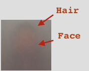
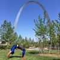
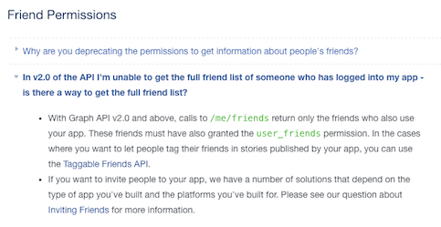

If you combined photos of all your friends' faces, what would it tell you?

This is what emerged for my friends:


## Constructing the Image

### Adding One at a Time

[](media/Face-Mash/face-mash-screens-side-by-side.mov)

The above gif illustrates one image at a time: I wasn't even close to reaching
the end.

### Slowly Adding More and More at a Time

[](media/Face-Mash/face-mash-screens.mov)

Each additional image has less and less of an impact on the final result. Here
is a sped up version in which the later images are being many at a time added:

## Reflection

I was a bit surprised that you could still make out what appears like hair and
part of the face:



because many photos are not photos of people's faces:




## Context

This week at [SFPC](http://sfpc.io), [Zach](http://thesystemis.com/) prompted us
to create an image that either melded multiple faces together. This assignment
was inspired by the work [Nancy Berson](http://nancyburson.com/) and [Jason
Salavon](http://salavon.com/).

## Process

Reorganized for understandability...

### 1) Facebook API Fail

Initially tried to use the Facebook api to obtain all of my friends and photos.
Turns out that you can [no longer obtain all of a user's friends on facebook]
(https://developers.facebook.com/docs/apps/faq).

> 

### 2) Manually Downloaded the Images

I went to `https://www.facebook.com/jonleung137/friends`, scrolled *all* the way
down, and clicked `File > Save` which gave me all the images inside a folder.

### 3) Obtaining Photos Sorted by Friend Interaction Frequency

Facebook uses some kind of algorithm to determine who you interact with more
and who you interact with less. I wanted the photos to be sorted by this
super fuzzy system.

To obtain the images, I did the following:

1. Went to https://www.facebook.com/jonleung137/friends
2. Scrolled *all* the way down.
3. Opened the Chrome console
4. Copied and pasted the entirety of the [minified JQuery code](https://code.jquery.com/jquery-2.2.4.min.js) into the console
5. Ran this code in the console which builds a series of  `wget` commands that I
   can run in bash and copies the code to my clipboard

  ```js
  var data = "";
  $.each($(".uiList._262m._4kg li div a img._s0._rv.img"), function(i, img) {
    data += 'wget -O ' + i + '.jpg \"' + img.src + '\"' + '\n'
  });
  copy(data);
  ```
6. Paste the code it gives me back into a `.sh` that I run
  ```bash
  wget -O 0.jpg "https://scontent-lga3-1.xx.fbcdn.net/v/t1.0-1/c31.0.100.100/p100x100/12553002_10204845042917344_5549521851422223829_n.jpg?oh=fd45978c63e265135e813a1170d4d0c1&oe=58366F94"
  wget -O 1.jpg "https://scontent-lga3-1.xx.fbcdn.net/v/t1.0-1/r90/c0.50.100.100/p100x100/10245434_10203348801465430_1552392502088381112_n.jpg?oh=ef2c086759f0d191a0dbfb58cfc1510d&oe=58376F81"
  wget -O 2.jpg "https://scontent-lga3-1.xx.fbcdn.net/v/t1.0-1/p100x100/5232_10153546669894355_4063517365387124125_n.jpg?oh=e424aa502ef0a87455a37a76199dc429&oe=5830D799"
  wget -O 3.jpg "https://scontent-lga3-1.xx.fbcdn.net/v/t1.0-1/p100x100/12804886_10208681677458375_4116887309452467904_n.jpg?oh=51e4c820cfddb5954ecedead8ceb37ca&oe=581E6055"
  # ...
  ```

### 4) Writing the Code

#### Psuedocode

- create an array of rgb vectors, one for each pixel of the image
  - initialize each of the rgb values initially to 0.
  - let's call this array, `pixelsTotalArray`
- then for each image
  - read the rgb value of each pixel
  - and += it to the corresponding array value in `pixelsTotalArray`
- then for each value of `pixelsTotalArray`, divide each rgb value by the number
  of images there are.

#### Commits:

_Note, my commits are currently not the most organized for external consumption
..._

See the commits to my project
[here](https://github.com/jonleung/face-mesh/commits/master):

## Future work

### Facial Detection

Instead of using all images directly as they appear on Facebook (because there
is a lot of noise from that), I want to use a facial recognition library to:

1. Exclude all photos that don't have frontal facing photos in them
2. Properly crop and resize the photos so that all the faces are the same size
   and orientation (see
  [this](http://docs.opencv.org/master/da/d60/tutorial_face_main.html#gsc.tab=0)
  for what I'm talking about).

### Obtain Higher Resolution Images

- You can [publicly access Facebook photos from just knowing someone's Facebook
  User ID](http://stackoverflow.com/questions/11743768/how-to-get-facebook-profile-large-square-picture)
- Since the user's ids are in the webpage, we can extract the IDs from there

### Combine Images Together

- Instead of loading more than 2000 individual images, combining the images
  together into a sprite sheet with ImageMagick would be ideal.
